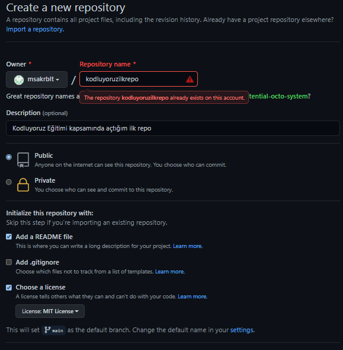

# Kodluyoruz Ilk Repo
Kodluyoruz Eğitimi kapsamında açtığım ilk repo

## Installation

Öncelikle projeyi clonelayın.

`git clone https://github.com/msakrblt/kodluyoruzilkrepo`

## Usage

Projeyi cloneladıktan sonra Visual Studio Code programını açınız.

`cd kodluyoruzilkrepo`

`code .`

## Contributing

Pull requestler kabul edilir. Büyük değişiklikler için, lütfen önce neyi değiştirmek istediğinizi tartışmak için bir konu açınız.

## License

